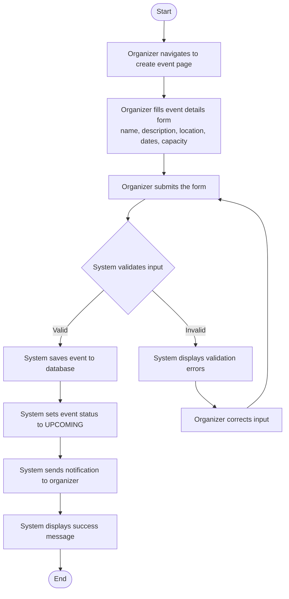

# Activity Diagram - Create Event

## Workflow Description

1. **Initiation**: The organizer navigates to the event creation page through the UI.
2. **Data Entry**: The organizer fills in event details including name, description, location, start/end dates, and capacity.
3. **Submission**: The organizer submits the form to the system.
4. **Validation**: The system validates all input fields (required fields not empty, dates are logical, capacity is positive).
5. **Success Path**: If valid, the event is persisted with status `UPCOMING` and the organizer is notified.
6. **Error Path**: If invalid, validation errors are shown and the organizer must correct them.
