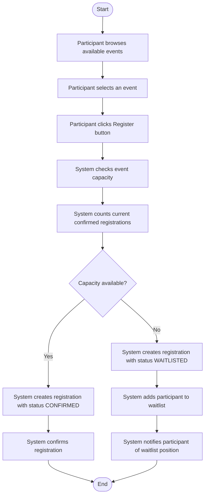

# Activity Diagram - Register for Event

## Workflow Description

1. **Event Selection**: The participant browses available events and selects one to register for.
2. **Registration Request**: The participant clicks the register button to initiate registration.
3. **Capacity Check**: The system checks the event's maximum capacity against the current number of confirmed registrations.
4. **Confirmation Path**: If capacity is available, the registration is created with status `CONFIRMED`.
5. **Waitlist Path**: If capacity is full, the registration is created with status `WAITLISTED`, and the participant is added to the waitlist with a notification.
