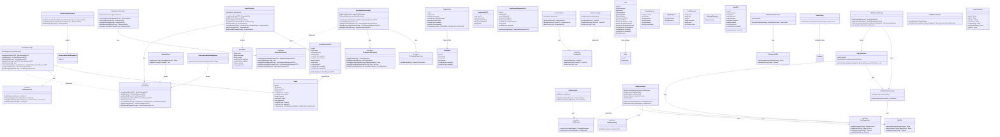

# Class Diagram - Event Registration System

```mermaid
classDiagram
    %% Event Service
    class EventController {
        -EventService eventService
        +createEvent(EventDTO) ResponseEntity
        +getAllEvents() ResponseEntity
        +getEventById(Long) ResponseEntity
        +updateEvent(Long, EventDTO) ResponseEntity
        +deleteEvent(Long) ResponseEntity
        +rescheduleEvent(Long, LocalDateTime, LocalDateTime) ResponseEntity
        +getUpcomingEvents() ResponseEntity
        +getEventsByOrganizer(Long) ResponseEntity
    }

    class EventService {
        <<interface>>
        +createEvent(EventDTO) EventResponseDTO
        +getAllEvents() List~EventResponseDTO~
        +getEventById(Long) EventResponseDTO
        +updateEvent(Long, EventDTO) EventResponseDTO
        +deleteEvent(Long) void
        +rescheduleEvent(Long, LocalDateTime, LocalDateTime) EventResponseDTO
        +getUpcomingEvents() List~EventResponseDTO~
        +getEventsByOrganizer(Long) List~EventResponseDTO~
    }

    class EventServiceImpl {
        -EventRepository eventRepository
        +createEvent(EventDTO) EventResponseDTO
        +getAllEvents() List~EventResponseDTO~
        +getEventById(Long) EventResponseDTO
        +updateEvent(Long, EventDTO) EventResponseDTO
        +deleteEvent(Long) void
        +rescheduleEvent(Long, LocalDateTime, LocalDateTime) EventResponseDTO
        +getUpcomingEvents() List~EventResponseDTO~
        +getEventsByOrganizer(Long) List~EventResponseDTO~
    }

    class EventRepository {
        <<interface>>
        +findByOrganizerId(Long) List~Event~
        +findUpcomingEvents(LocalDateTime) List~Event~
        +findByStartDateBetween(LocalDateTime, LocalDateTime) List~Event~
        +findByStatus(EventStatus) List~Event~
    }

    class Event {
        -Long id
        -String name
        -String description
        -String location
        -LocalDateTime startDate
        -LocalDateTime endDate
        -Integer capacity
        -EventStatus status
        -Long organizerId
        -LocalDateTime createdAt
        -LocalDateTime updatedAt
        <<enum>> EventStatus: UPCOMING, ONGOING, COMPLETED, CANCELLED
    }

    class EventDTO {
        -String name
        -String description
        -String location
        -LocalDateTime startDate
        -LocalDateTime endDate
        -Integer capacity
        -Long organizerId
    }

    class EventResponseDTO {
        -Long id
        -String name
        -String description
        -String location
        -LocalDateTime startDate
        -LocalDateTime endDate
        -Integer capacity
        -String status
        -Long organizerId
        -LocalDateTime createdAt
        -LocalDateTime updatedAt
        +fromEntity(Event) EventResponseDTO
    }

    class LoggingAspect {
        +logExecutionTime(ProceedingJoinPoint) Object
        +logAfterThrowing(Throwable) void
    }

    class PerformanceMonitoringAspect {
        +monitorPerformance(ProceedingJoinPoint) Object
    }

    class ResourceNotFoundException {
        -Object id
    }

    class GlobalExceptionHandler {
        +handleResourceNotFound(ResourceNotFoundException) ResponseEntity
        +handleIllegalArgument(IllegalArgumentException) ResponseEntity
        +handleGeneric(Exception) ResponseEntity
    }

    %% Registration Service
    class RegistrationController {
        -RegistrationService registrationService
        +createRegistration(RegistrationDTO) ResponseEntity
        +cancelRegistration(Long) ResponseEntity
        +getRegistrationById(Long) ResponseEntity
        +getRegistrationsByEvent(Long) ResponseEntity
        +getRegistrationsByParticipant(Long) ResponseEntity
    }

    class RegistrationService {
        <<interface>>
        +createRegistration(RegistrationDTO) RegistrationResponseDTO
        +cancelRegistration(Long) void
        +getRegistrationsByEvent(Long) List~RegistrationResponseDTO~
        +getRegistrationsByParticipant(Long) List~RegistrationResponseDTO~
        +getRegistrationById(Long) RegistrationResponseDTO
    }

    class RegistrationServiceImpl {
        -RegistrationRepository registrationRepository
        -ParticipantRepository participantRepository
        +createRegistration(RegistrationDTO) RegistrationResponseDTO
        +cancelRegistration(Long) void
        +getRegistrationsByEvent(Long) List~RegistrationResponseDTO~
        +getRegistrationsByParticipant(Long) List~RegistrationResponseDTO~
        +getRegistrationById(Long) RegistrationResponseDTO
    }

    class RegistrationRepository {
        <<interface>>
        +findByEventId(Long) List~Registration~
        +findByParticipantId(Long) List~Registration~
        +countByEventIdAndStatus(Long, RegistrationStatus) long
        +existsByEventIdAndParticipantId(Long, Long) boolean
        +findByEventIdAndStatus(Long, RegistrationStatus) List~Registration~
    }

    class ParticipantRepository {
        <<interface>>
        +findByEmail(String) Optional~Participant~
    }

    class Registration {
        -Long id
        -Long eventId
        -Participant participant
        -LocalDateTime registrationDate
        -RegistrationStatus status
        -LocalDateTime createdAt
        -LocalDateTime updatedAt
        <<enum>> RegistrationStatus: CONFIRMED, CANCELLED, WAITLISTED
    }

    class Participant {
        -Long id
        -String name
        -String email
        -String phone
        -LocalDateTime createdAt
        -LocalDateTime updatedAt
    }

    class RegistrationDTO {
        -Long eventId
        -Long participantId
        -String participantName
        -String participantEmail
        -String status
    }

    class RegistrationResponseDTO {
        -Long id
        -Long eventId
        -Long participantId
        -String participantName
        -String participantEmail
        -LocalDateTime registrationDate
        -String status
        -LocalDateTime createdAt
        +fromEntity(Registration) RegistrationResponseDTO
    }

    %% User Service
    class AuthController {
        -AuthService authService
        +registerUser(SignupRequest) ResponseEntity
        +authenticateUser(LoginRequest) ResponseEntity
    }

    class UserController {
        -UserService userService
        +getUserById(Long) ResponseEntity
        +updateUser(Long, UserDTO) ResponseEntity
        +deleteUser(Long) ResponseEntity
    }

    class AuthService {
        <<interface>>
        +registerUser(SignupRequest) MessageResponse
        +authenticateUser(LoginRequest) JwtResponse
    }

    class AuthServiceImpl {
        -AuthenticationManager authenticationManager
        -UserRepository userRepository
        -RoleRepository roleRepository
        -PasswordEncoder passwordEncoder
        -JwtUtils jwtUtils
        +registerUser(SignupRequest) MessageResponse
        +authenticateUser(LoginRequest) JwtResponse
    }

    class UserService {
        <<interface>>
        +getUserById(Long) UserDTO
        +updateUser(Long, UserDTO) UserDTO
        +deleteUser(Long) void
    }

    class UserServiceImpl {
        -UserRepository userRepository
        +getUserById(Long) UserDTO
        +updateUser(Long, UserDTO) UserDTO
        +deleteUser(Long) void
    }

    class UserRepository {
        <<interface>>
        +findByUsername(String) Optional~User~
        +findByEmail(String) Optional~User~
        +existsByUsername(String) Boolean
        +existsByEmail(String) Boolean
    }

    class RoleRepository {
        <<interface>>
        +findByName(String) Optional~Role~
    }

    class User {
        -Long id
        -String username
        -String email
        -String password
        -String firstName
        -String lastName
        -String phoneNumber
        -boolean enabled
        -boolean accountNonLocked
        -boolean accountNonExpired
        -boolean credentialsNonExpired
        -LocalDateTime lastLoginDate
        -LocalDateTime createdAt
        -LocalDateTime updatedAt
        -Set~Role~ roles
    }

    class Role {
        -Long id
        -String name
    }

    class SignupRequest {
        -String username
        -String email
        -String password
        -String firstName
        -String lastName
        -String phoneNumber
    }

    class LoginRequest {
        -String username
        -String password
    }

    class JwtResponse {
        -String token
        -String type
        -Long id
        -String username
        -String email
        -List~String~ roles
    }

    class MessageResponse {
        -String message
    }

    class UserDTO {
        -Long id
        -String username
        -String email
        -String firstName
        -String lastName
        -String phoneNumber
        -boolean enabled
        -List~String~ roles
        -LocalDateTime createdAt
        +fromEntity(User) UserDTO
    }

    class JwtUtils {
        +generateJwtToken(Authentication) String
        +getUserNameFromJwtToken(String) String
        +validateJwtToken(String) boolean
    }

    class AuthTokenFilter {
        -JwtUtils jwtUtils
        -UserDetailsServiceImpl userDetailsService
        +doFilterInternal(HttpServletRequest, HttpServletResponse, FilterChain) void
    }

    class WebSecurityConfig {
        +filterChain(HttpSecurity) SecurityFilterChain
        +authenticationProvider() DaoAuthenticationProvider
        +authenticationManager(AuthenticationConfiguration) AuthenticationManager
        +passwordEncoder() PasswordEncoder
    }

    class UserDetailsServiceImpl {
        -UserRepository userRepository
        +loadUserByUsername(String) UserDetails
    }

    %% API Gateway
    class RouteConfig {
        +customRouteLocator(RouteLocatorBuilder) RouteLocator
    }

    class GatewayJwtUtils {
        +getUserNameFromJwtToken(String) String
        +validateJwtToken(String) boolean
    }

    class JwtAuthenticationFilter {
        -JwtUtils jwtUtils
        +filter(ServerWebExchange, GatewayFilterChain) Mono~Void~
    }

    class GlobalErrorHandler {
        +errorAttributes() ErrorAttributes
        +errorRouterFunction(ServerCodecConfigurer) RouterFunction~ServerResponse~
    }

    %% UI Service
    class HomeController {
        +index() String
        +login() String
        +register() String
        +eventsList() String
        +createEvent() String
        +eventDetail(String) String
        +profile() String
    }

    %% Relationships
    EventController --> EventService : uses
    EventServiceImpl ..|> EventService : implements
    EventServiceImpl --> EventRepository : uses
    EventController --> EventDTO : receives
    EventController --> EventResponseDTO : returns
    EventServiceImpl --> Event : creates/manages
    EventResponseDTO --> Event : converts from
    RegistrationController --> RegistrationService : uses
    RegistrationServiceImpl ..|> RegistrationService : implements
    RegistrationServiceImpl --> RegistrationRepository : uses
    RegistrationServiceImpl --> ParticipantRepository : uses
    Registration --> Participant : Many-to-One
    AuthController --> AuthService : uses
    UserController --> UserService : uses
    AuthServiceImpl ..|> AuthService : implements
    UserServiceImpl ..|> UserService : implements
    AuthServiceImpl --> UserRepository : uses
    AuthServiceImpl --> RoleRepository : uses
    AuthServiceImpl --> JwtUtils : uses
    User --> Role : Many-to-Many
    AuthTokenFilter --> JwtUtils : uses
    AuthTokenFilter --> UserDetailsServiceImpl : uses
    WebSecurityConfig --> AuthTokenFilter : injects
    WebSecurityConfig --> UserDetailsServiceImpl : injects
    UserDetailsServiceImpl --> UserRepository : uses
    RouteConfig --> Gateway : configures routes
    JwtAuthenticationFilter --> GatewayJwtUtils : uses
    LoggingAspect --> EventService : weaves
    PerformanceMonitoringAspect --> EventService : weaves
    GlobalExceptionHandler --> ResourceNotFoundException : handles
```
