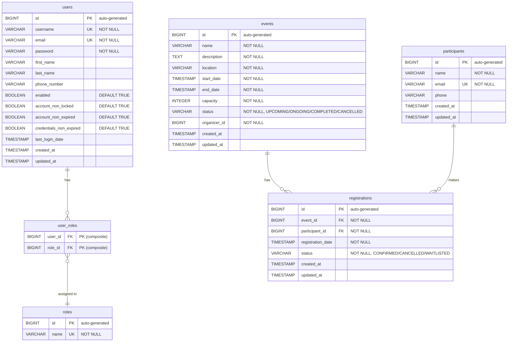

# Entity Relationship Diagram - Event Registration System

## Database Schema Summary

### User Service Database

| Table | Description | Columns (key constraints) |
|-------|-------------|--------------------------|
| **users** | User accounts with security attributes | id (PK), username (UK), email (UK), password, first_name, last_name, phone_number, enabled, account_non_locked, account_non_expired, credentials_non_expired, last_login_date, created_at, updated_at |
| **roles** | Authorization roles | id (PK), name (UK) |
| **user_roles** | Many-to-many junction | user_id (FK), role_id (FK) |

### Event Service Database

| Table | Description | Columns (key constraints) |
|-------|-------------|--------------------------|
| **events** | Event details and schedule | id (PK), name, description, location, start_date, end_date, capacity, status, organizer_id, created_at, updated_at |

### Registration Service Database

| Table | Description | Columns (key constraints) |
|-------|-------------|--------------------------|
| **participants** | Participant information | id (PK), name, email (UK), phone, created_at, updated_at |
| **registrations** | Event registrations | id (PK), event_id (FK → events), participant_id (FK → participants), registration_date, status, created_at, updated_at |

## Entity Relationships

| Relationship | Type | Description |
|-------------|------|-------------|
| users → user_roles | One-to-Many | One user can have multiple role assignments |
| roles → user_roles | One-to-Many | One role can be assigned to many users |
| events → registrations | One-to-Many | One event can have many registrations |
| participants → registrations | One-to-Many | One participant can make many registrations |

## Index Recommendations

| Table | Column(s) | Index Type | Rationale |
|-------|-----------|------------|-----------|
| users | username | Unique | Lookup during authentication |
| users | email | Unique | Lookup during registration/profile |
| events | start_date | B-tree | Sorting upcoming events |
| events | status | B-tree | Filtering by status |
| events | organizer_id | B-tree | Lookup events by organizer |
| registrations | event_id | B-tree | Lookup registrations for an event |
| registrations | participant_id | B-tree | Lookup registrations by participant |
| registrations | (event_id, status) | Composite | Capacity counting query |
| participants | email | Unique | Lookup during registration |
