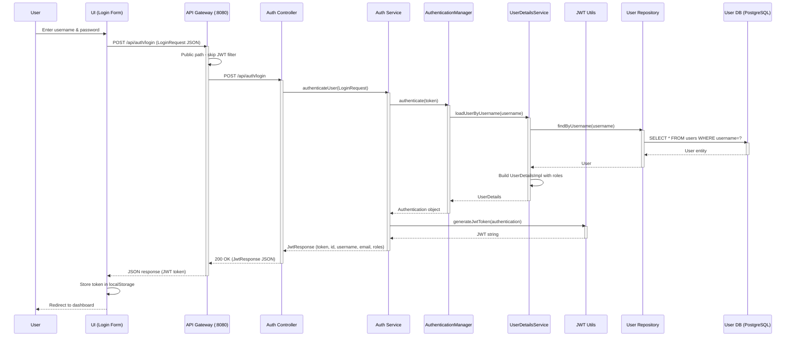

# Sequence Diagram - Authentication

## Step-by-Step Flow

| Step | Action | Description |
|------|--------|-------------|
| 1 | User submits credentials | Enters username and password |
| 2 | UI forwards request | POST to API Gateway (public endpoint) |
| 3 | Gateway skips JWT filter | Path `/api/auth/login` is whitelisted |
| 4 | AuthController receives | Delegates to AuthService |
| 5 | Authentication | AuthenticationManager validates credentials |
| 6 | User lookup | UserDetailsServiceImpl loads user from DB |
| 7 | JWT generation | JwtUtils generates signed JWT token |
| 8 | Response | JwtResponse returned with token, user info, roles |
| 9 | Token storage | UI stores token in localStorage for subsequent requests |

## Endpoint Details

- **Login URL**: `POST /api/auth/login`
- **Signup URL**: `POST /api/auth/signup`
- **Authentication**: None (public endpoints)
- **Login Request Body**: LoginRequest (username, password)
- **Login Response**: 200 OK with JwtResponse (token, id, username, email, roles)
- **Signup Request Body**: SignupRequest (username, email, password, firstName, lastName, phoneNumber)
- **Signup Response**: 200 OK with MessageResponse
