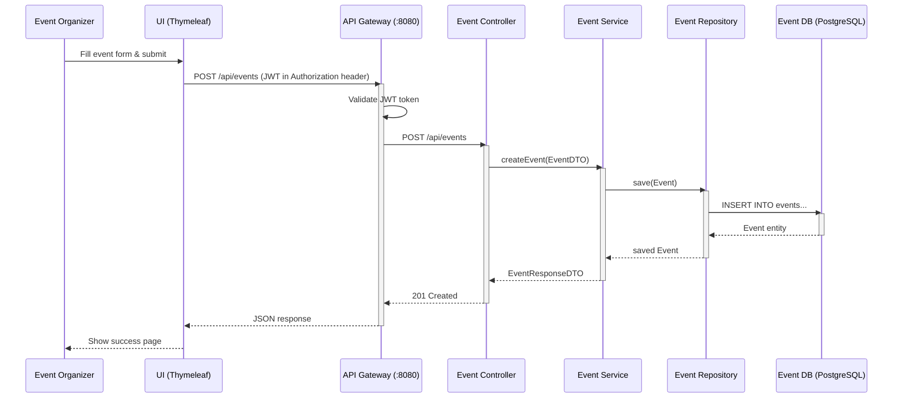

# Sequence Diagram - Create Event

## Step-by-Step Flow

| Step | Action | Description |
|------|--------|-------------|
| 1 | Organizer submits form | Organizer fills event details and clicks submit |
| 2 | UI sends request | UI sends POST request to API Gateway with JWT |
| 3 | Gateway validates JWT | Gateway checks token validity before forwarding |
| 4 | Controller receives request | EventController handles the request |
| 5 | Service processes | EventService.createEvent() maps DTO to entity |
| 6 | Repository persists | EventRepository saves to database |
| 7 | Response returned | EventResponseDTO returned to client with 201 status |

## Endpoint Details

- **URL**: `POST /api/events`
- **Authentication**: JWT required
- **Request Body**: EventDTO (name, description, location, startDate, endDate, capacity, organizerId)
- **Response**: 201 Created with EventResponseDTO body
