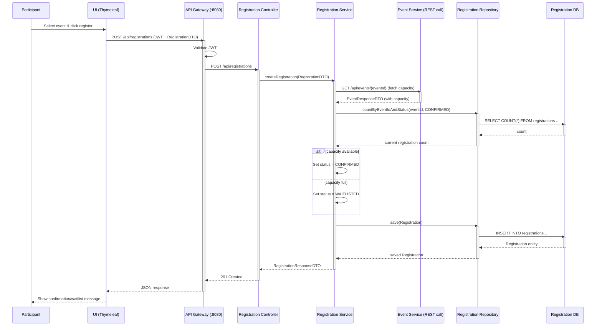

# Sequence Diagram - Register for Event

## Step-by-Step Flow

| Step | Action | Description |
|------|--------|-------------|
| 1 | Participant registers | Selects event and clicks register |
| 2 | UI sends request | POST request to API Gateway with JWT |
| 3 | Gateway validates JWT | Token validation before forwarding |
| 4 | Controller receives | RegistrationController handles request |
| 5 | Fetch event capacity | RegistrationService calls EventService via REST |
| 6 | Count registrations | Check current confirmed registration count |
| 7 | Decision | If count < capacity → CONFIRMED, else → WAITLISTED |
| 8 | Persist registration | Save to registration database |
| 9 | Response | Return RegistrationResponseDTO with 201 status |

## Endpoint Details

- **URL**: `POST /api/registrations`
- **Authentication**: JWT required
- **Request Body**: RegistrationDTO (eventId, participantId, participantName, participantEmail)
- **Response**: 201 Created with RegistrationResponseDTO body
