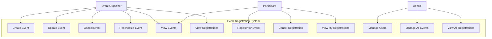

# Use Case Diagram - Event Registration System

## Actors

| Actor | Description |
|-------|-------------|
| **Event Organizer** | Creates and manages events, views registrations |
| **Participant** | Browses events, registers, manages own registrations |
| **Admin** | Manages users, oversees all events and registrations |

## Use Cases

| ID | Use Case | Actor | Description |
|----|----------|-------|-------------|
| UC1 | Create Event | Organizer | Fill event details form and submit to create a new event |
| UC2 | Update Event | Organizer | Modify existing event details |
| UC3 | Cancel Event | Organizer | Cancel an existing event |
| UC4 | Reschedule Event | Organizer | Change event date/time |
| UC5 | View Events | Organizer, Participant | Browse list of available events |
| UC6 | View Registrations | Organizer | View all registrations for an event |
| UC7 | Register for Event | Participant | Register to attend an event |
| UC8 | Cancel Registration | Participant | Cancel own registration |
| UC9 | View My Registrations | Participant | View personal registration history |
| UC10 | Manage Users | Admin | Create, update, disable user accounts |
| UC11 | Manage All Events | Admin | Oversee and manage any event in the system |
| UC12 | View All Registrations | Admin | View all registrations across all events |
